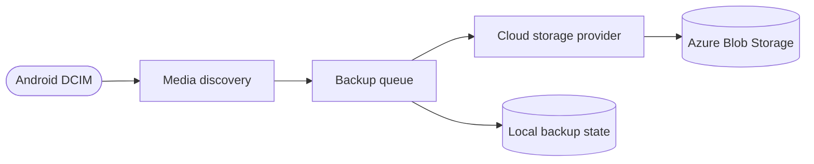

## Overview

Android DCIM Cloud Sync is a planned open-source Android application for backing up photos and videos from an Android device's DCIM collection to cloud storage. The first implementation will target Azure Blob Storage and a Pixel 7, with storage-provider boundaries designed to support additional cloud providers later.

The application will use .NET 10 and .NET MAUI. The solution and projects will be created with Visual Studio 2026 after this repository bootstrap is complete.

> [!IMPORTANT]
> This repository currently contains project conventions and development tooling only. Application code has not been scaffolded yet.

## Motivation

This project is intentionally small and focused so it can serve as a practical way to learn .NET MAUI while solving a real mobile backup problem.

Transferring a large Android DCIM collection to a computer over USB can be unreliable. Managed photo services provide convenient automatic synchronization, but some download and export workflows may not return files with every original EXIF field intact, including geolocation metadata. Original-quality photos and increasingly large videos can also make general-purpose photo-service storage comparatively expensive for long-term retention.

Object storage provides a different trade-off. Uploading the original file bytes to cloud storage can preserve the source media and its embedded metadata, while cool and archive storage tiers can reduce long-term storage cost. Those tiers may have retrieval delays and additional access charges, so the application is intended as an independent archival backup rather than a replacement for a photo-browsing service.

## Goals

- Discover photos and videos through Android's supported media APIs
- Upload media without loading entire files into memory
- Preserve stable relative paths and useful media metadata
- Resume interrupted uploads and avoid uploading unchanged content repeatedly
- Respect network, battery, and Android background-execution constraints
- Keep cloud credentials and personal media out of source control and logs
- Isolate Azure-specific behavior behind a provider abstraction

## Initial Scope

The first release is intended to:

- Run on Android, with a Pixel 7 as the initial physical-device target
- Read user-approved photos and videos from the DCIM media collection
- Back up content to an Azure Blob Storage container
- Track backup state locally so work can resume after interruption
- Report progress and actionable failures without exposing personal data

Automatic deletion, bidirectional synchronization, and remote-to-device restore are out of scope until their safety behavior is designed and tested explicitly.

## Planned Data Flow

## Security and Privacy

- Never embed Azure Storage account keys, connection strings, or long-lived credentials in the application package.
- Prefer a short-lived, least-privilege SAS or an interactive identity flow. Persist sensitive values only through .NET MAUI secure storage.
- Treat packaged configuration as public because values can be extracted from an APK or Android App Bundle.
- Do not log media contents, access tokens, SAS query strings, full local paths, or personally identifying filenames.
- Request the minimum Android permissions required. Broad all-files access must not be introduced without a documented need and explicit review.
- Keep signing keys, keystores, local configuration, and generated application packages outside source control.

See [SECURITY.md](SECURITY.md) for vulnerability reporting and credential-handling expectations.

## Development Prerequisites

- Visual Studio 2026 with the .NET MAUI and Android development workloads
- .NET 10 SDK selected by Visual Studio
- Android SDK and either an emulator or a USB-connected Android device
- An Azure Storage development resource or Azurite when the Azure provider is introduced
- PowerShell 7 and pre-commit for repository validation

## Repository Conventions

- Application and test projects live under `src/`.
- The solution uses the modern `.slnx` format.
- Shared MSBuild properties and NuGet versions belong in `Directory.Build.props` and `Directory.Packages.props` after project scaffolding.
- GitVersion provides repository versioning.
- Linting runs with `pre-commit run --all-files`; the pre-push hook is opt-in through `pre-commit install`.
- Copilot conventions live in `.github/copilot-instructions.md` and `.github/instructions/`.

## License

This project is released into the public domain under [The Unlicense](LICENSE).
