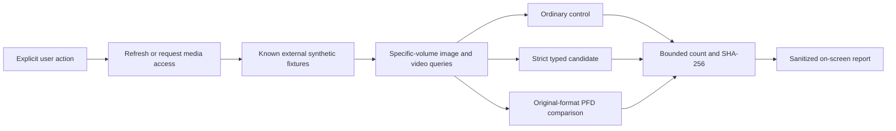

# Android DCIM Cloud Sync

## Overview

Android DCIM Cloud Sync is a planned open-source Android application for copying user-approved photos and videos from an Android device's DCIM collection to cloud storage. Azure Blob Storage is the first planned provider, and a Pixel 7 is the initial physical-device target. Future provider contracts must not make application and domain code depend directly on Azure SDK types.

The repository contains a Visual Studio 2026 .NET 10 MAUI application with a temporary, foreground, synthetic-only MediaStore diagnostic. The diagnostic gathers evidence needed before production media and provider contracts are designed. The root solution and centralized SDK, build, and package files provide a stable local build entry point.

> [!IMPORTANT]
> Backup discovery, Azure upload, persistence, authentication, background scheduling, resume, deduplication, and deletion are not implemented. The current MediaStore code is a disposable diagnostic, not production backup behavior.

## Current Implementation

The current baseline provides:

* One accessible MAUI Shell page with explicit permission, run, and current-run cancellation controls
* An app-local Android-free diagnostic contract and an Android MediaStore implementation
* Specific-volume queries restricted to seven known synthetic fixture identities
* Ordinary, strict typed, and original-format file-descriptor byte comparisons
* Sanitized aggregate, digest, descriptor, environment, and result-code output
* An Android-only `net10.0-android` application with a minimum Android API level of 33
* The permanent application ID `io.github.f2calv.androiddcimcloudsync`
* Android application-data backup disabled with `android:allowBackup="false"`
* Root `DcimCloudSync.slnx`, `global.json`, `Directory.Build.props`, and `Directory.Packages.props` build entry points

The retained icon, splash screen, and color palette come from the scaffold and are temporary. They are not final product branding.

## Temporary Pixel 7 MediaStore Diagnostic

The diagnostic runs only after a visible page action. Permission prompts appear only after the user selects an image, video, combined-access, or selection-management control. Selecting **Run diagnostic** starts one foreground query and comparison run. Selecting **Cancel current run** cancels only that run, signals active provider operations, and closes the active stream or descriptor.

Fixture media is not stored in this repository or packaged in the application. Before a device run, obtain the separately prepared `pixel7-mediastore-v1` synthetic bundle and transfer its seven import files to the Pixel 7 outside the application. Preserve the bundle's intended DCIM, non-DCIM, and prefix-control placement classes so Android can index them. Fixture transfer and Visual Studio deployment are manual owner actions; the application does not import or create the fixtures.

The seven fixture classes are:

* A JPEG without EXIF location metadata in nested DCIM storage
* An AVC MP4 in DCIM storage
* A Main 10 HEVC MP4 in DCIM storage
* A 547,603,109-byte AVC MP4 in DCIM storage for active-read cancellation
* A JPEG in non-DCIM Pictures storage as an image control
* An AVC MP4 in non-DCIM Movies storage as a video control
* A JPEG in DCIM-like prefix storage as a path-boundary control

For selected-only access, choose exactly the fixture IDs `jpeg-dcim-nested-v1` and `hevc-main10-dcim-v1`. The packaged manifest defines deterministic expected sets for full, images-only, videos-only, selected-only, and denied scenarios. Mixed access is derived from the held broad grant and selected subset. The diagnostic queries each mounted external volume's image and video collection separately, but a run on one Pixel volume cannot prove multi-volume behavior.

Each visible, expected fixture is compared through three independent paths:

| Path                           | Diagnostic purpose                                                                                                      |
| ------------------------------ | ----------------------------------------------------------------------------------------------------------------------- |
| Ordinary control               | Opens the normal input stream to establish the representation returned without original-content or no-transcode intent  |
| Strict typed candidate         | Applies require-original intent and requests a typed descriptor with compatible transcoding disabled                    |
| Original-format PFD comparison | Applies require-original intent, opens a file descriptor, and asks MediaStore for its original-format descriptor        |

Each path reads sequentially with a bounded buffer and computes a byte count and SHA-256 for comparison with the independently prepared manifest. These comparisons gather evidence; their presence does not guarantee original production bytes.



The report contains neutral fixture IDs, permission state, privacy-safe environment values, aggregate counts, result codes, expected and observed byte counts and digests, descriptor traits, and durations. It does not expose fixture display names, relative placements, volume names, content URIs, local paths, EXIF values, coordinates, media payloads, or exception details. It is displayed in memory and is not persisted or transmitted.

## Diagnostic Permissions

The source manifest declares five permissions. The diagnostic exercises only the three visual-media permissions; the two pre-existing network permissions remain unused.

| Permission                                           | Reason                                                                                                   |
| ---------------------------------------------------- | -------------------------------------------------------------------------------------------------------- |
| `android.permission.READ_MEDIA_IMAGES`               | Allows API 33 and later discovery and opening of the known synthetic image fixtures                      |
| `android.permission.READ_MEDIA_VIDEO`                | Allows API 33 and later discovery and opening of the known synthetic video and cancellation fixtures     |
| `android.permission.READ_MEDIA_VISUAL_USER_SELECTED` | Allows API 34 and later selected-only visibility and reselection behavior to be represented explicitly   |
| `android.permission.INTERNET`                        | Retained for future provider work; the diagnostic performs no network request                            |
| `android.permission.ACCESS_NETWORK_STATE`            | Retained for future connectivity checks; the diagnostic does not inspect connectivity                    |

`ACCESS_MEDIA_LOCATION` is intentionally absent. The diagnostic does not request device location, does not use a location-bearing fixture, and cannot prove that protected photo-location metadata is unredacted. Legacy storage, broad all-files, camera, notification, foreground-service, and boot permissions are also absent.

## Evidence and Limitations

Evidence classifications are intentionally separate:

| Classification      | Current status                                                                                               |
| ------------------- | ------------------------------------------------------------------------------------------------------------ |
| Platform-documented | Android permission, MediaStore, and representation contracts are recorded in research                        |
| Binding-verified    | Required symbols were identified in the installed .NET Android API 36 reference pack                         |
| Source-implemented  | Temporary contracts, Android code, page, manifest, and fixture manifest are present and statically reviewed  |
| Compile-validated   | Debug and Release package-free compile and merged-manifest integration passed with zero warnings and errors  |
| Device-observed     | Not run; no Pixel 7 result, hash match, permission transition, or cancellation behavior has been observed    |

The owner explicitly selected **Stop before device execution** on 2026-08-29. The spike is compile-complete but empirically incomplete: no fixture transfer, deployment, launch, permission exercise, or diagnostic run occurred, and no runtime open path was selected for production.

The diagnostic does not establish complete behavior across Android API levels 33 through 36, Android vendors, MediaProvider versions, or multiple mounted volumes. Its seven classes do not cover HEIC, DNG, motion photos, pending or trashed rows, mutation, removal, or protected location metadata. It provides no backup, Azure upload, persistence, scheduling, production reconciliation, deletion, or production exactness guarantee. A future production claim requires approved device evidence, broader test coverage, and replacement or redesign of the temporary diagnostic boundary.

## Motivation

This project is intentionally small and focused so it can serve as a practical way to learn .NET MAUI while solving a real mobile backup problem.

Transferring a large Android DCIM collection to a computer over USB can be unreliable. Managed photo services provide convenient automatic synchronization, but some download and export workflows may not return files with every original EXIF field intact, including geolocation metadata. Original-quality photos and increasingly large videos can also make general-purpose photo-service storage comparatively expensive for long-term retention.

Object storage provides a different trade-off. Uploading the original file bytes to cloud storage can preserve the source media and its embedded metadata, while cool and archive storage tiers can reduce long-term storage cost. Those tiers may have retrieval delays and additional access charges, so the application is intended as an independent archival backup rather than a replacement for a photo-browsing service.

## Planned Goals

* Discover user-approved photos and videos through Android's supported media APIs
* Stream media from content URIs without requiring filesystem paths or loading entire files into memory
* Preserve available original bytes and the operational metadata required for safe reconciliation
* Make interrupted work resumable and uploads idempotent without relying on filenames alone
* Propagate cancellation through discovery, hashing, persistence, retry, and upload operations
* Respect network, battery, and Android background-execution constraints
* Keep cloud credentials and personal media out of source control and logs
* Isolate Azure-specific behavior behind provider-neutral contracts

## Planned Initial Scope

The planned first release is copy-only. It is intended to:

* Run on Android, with a Pixel 7 as the initial physical-device target
* Read user-approved photos and videos from the DCIM media collection
* Copy content to a private Azure Blob Storage container
* Track backup state locally so work can resume after interruption
* Report progress and actionable failures without exposing personal data

Automatic deletion, bidirectional synchronization, and remote-to-device restore are out of scope until their safety behavior is designed and tested explicitly.

## Planned Architecture

The following diagram describes planned backup behavior, not the temporary diagnostic that exists today.


The future Azure provider must remain compatible with an existing Blob container. Its non-secret configuration will support separate destination prefixes for JPG and MP4 media without forcing a new container or naming layout. Actual infrastructure identifiers, prefix values, endpoints, and credentials do not belong in tracked documentation or configuration.

## Security and Privacy

The application stores no credentials, diagnostic report, or backup state. The temporary diagnostic reads only manifest-known synthetic fixtures and sends no media or product data off the device. The pre-existing network permissions remain unused, and no network, provider, persistence, telemetry, or upload service is registered.

Android application-data backup is disabled with `android:allowBackup="false"`. Future persistent state requires a separate review of Android backup and device-transfer protections.

The following rules govern planned product work:

* Never embed Azure Storage account keys, connection strings, client secrets, signing passwords, or long-lived SAS values in the application package.
* Prefer short-lived, least-privilege access. Persist sensitive user-provided values only through .NET MAUI secure storage or a stronger platform-backed mechanism.
* Treat packaged configuration as public because values can be extracted from an APK or Android App Bundle.
* Do not log media contents, access tokens, SAS query strings, content URIs, full local paths, or personally identifying filenames.
* Request the minimum Android permissions required. Do not introduce broad all-files access without explicit approval and documented justification.
* Keep signing keys, keystores, local configuration, personal media, and generated application packages outside source control.
* Keep v1 copy-only. Do not add local or remote deletion or bidirectional synchronization without explicit approval and dedicated safety tests.

See [SECURITY.md](SECURITY.md) for vulnerability reporting and credential-handling expectations.

## Development Prerequisites

* Visual Studio 2026 with .NET MAUI and Android development workloads
* Stable .NET SDK `10.0.400`, or a compatible later stable .NET 10 feature band selected by `global.json`
* Android SDK and a Pixel 7 configured for USB or wireless debugging
* The separately prepared `pixel7-mediastore-v1` synthetic fixture bundle for an approved device run
* PowerShell 7
* Plain Git command-line tooling
* Pre-commit for full repository lint validation

Azure resources are not required for the diagnostic because no provider exists.

## Local Development Loop

Use the repository root as the working directory. For an approved device run, transfer only the external synthetic fixture bundle, open `DcimCloudSync.slnx` in Visual Studio 2026, select the Android application and the paired Pixel 7, then build and deploy interactively over USB or Android wireless debugging. Device pairing, fixture transfer, deployment, launch, permission choices, and diagnostic invocation remain deliberate owner actions. Do not use personal media as diagnostic input.

The root solution remains the restore entry point. With the required SDK and Android workload already installed, these commands run the verified package-free project validation and inspect dependencies:

```powershell
dotnet workload restore .\DcimCloudSync.slnx
dotnet restore .\DcimCloudSync.slnx
dotnet msbuild .\src\DcimCloudSync\DcimCloudSync.csproj -nologo -t:"Compile;_ReadAndroidManifest" -p:Configuration=Debug -p:DesignTimeBuild=false
dotnet msbuild .\src\DcimCloudSync\DcimCloudSync.csproj -nologo -t:"Compile;_ReadAndroidManifest" -p:Configuration=Release -p:DesignTimeBuild=false
dotnet list .\src\DcimCloudSync\DcimCloudSync.csproj package --vulnerable --include-transitive --no-restore
```

Stop and review the environment if workload restore requests an installation or elevation decision. The validation covers managed compilation, analyzers and source generators, MAUI XAML, Android resource compilation and designer output, generated Java wrappers, and pre-merge and merged manifests. It does not run `javac`, final `aapt2` linking, D8 or R8, dex generation, packaging, signing, installation, deployment, or runtime behavior.

`_ReadAndroidManifest` is an internal, version-sensitive .NET Android target. Revalidate this sequence after Android workload updates. Normal MAUI `Build` is not package-free in the pinned Microsoft.Android.Sdk 36.1.69: `AndroidBuildApplicationPackage=false` does not suppress APK or AAB creation, and `AndroidKeyStore=false` does not disable signing.

See [src/DcimCloudSync/README.md](src/DcimCloudSync/README.md) for project-specific details.

## Automation and Distribution Status

The existing GitHub Actions workflow performs repository linting only. Android compilation in CI, automated device deployment, production signing, release artifacts, and Google Play publishing are explicitly deferred. No Play Store readiness, production backup readiness, or signed-release capability is implied by the diagnostic.

## Repository Conventions

* Application and future test projects live under `src/`.
* The root solution uses the modern `.slnx` format.
* Shared MSBuild properties and NuGet versions are centralized in `Directory.Build.props` and `Directory.Packages.props`.
* `global.json` selects the stable .NET 10 SDK policy.
* GitVersion provides repository versioning.
* Linting runs with `pre-commit run --all-files`; the pre-push hook is opt-in through `pre-commit install`.
* Use plain Git CLI for every repository operation. Do not use GitKraken.
* Copilot conventions live in `.github/copilot-instructions.md` and `.github/instructions/`.

## License

This project is released into the public domain under [The Unlicense](LICENSE).
